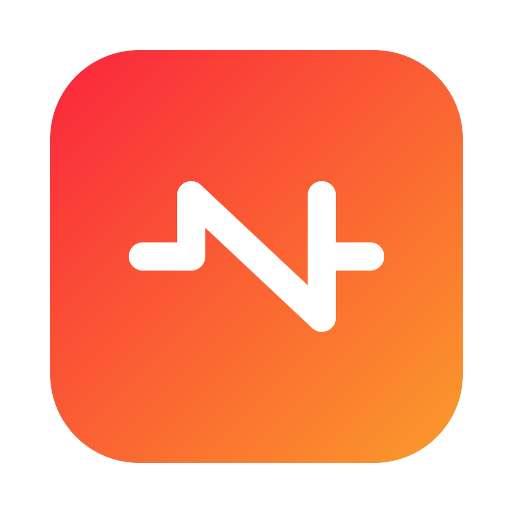
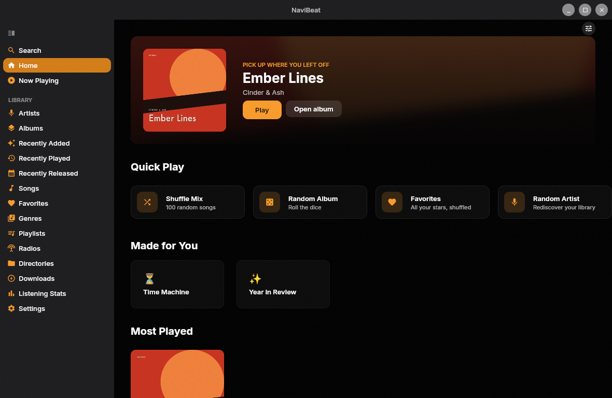
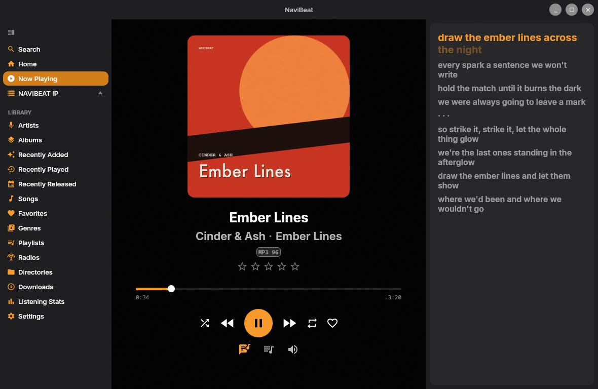
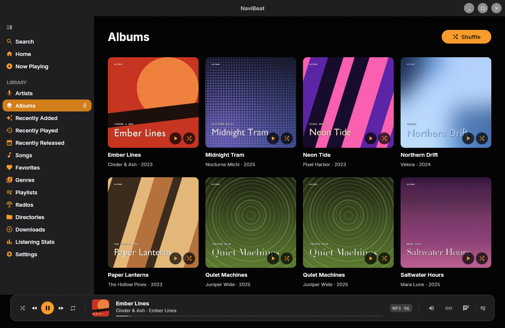
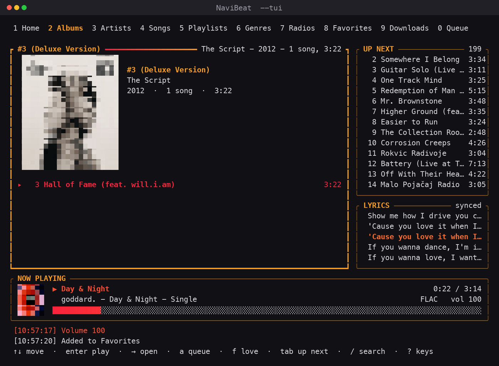
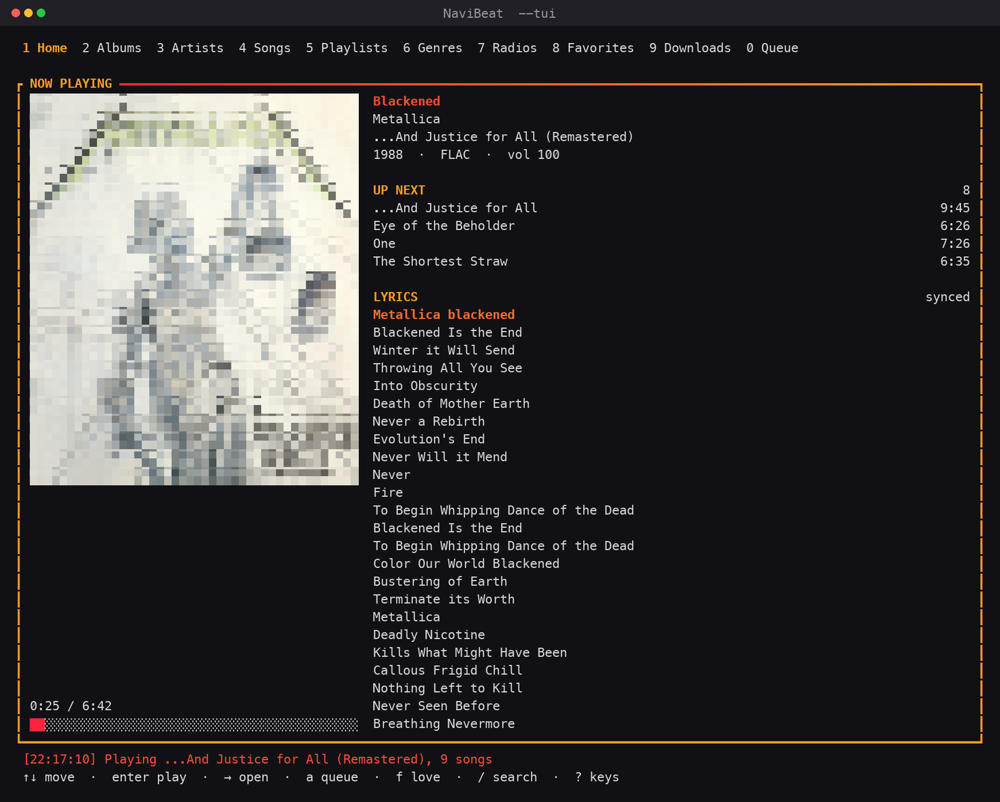
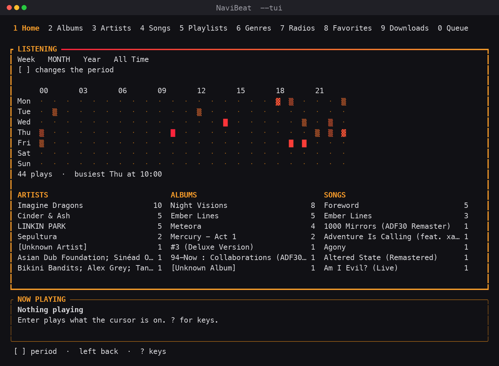
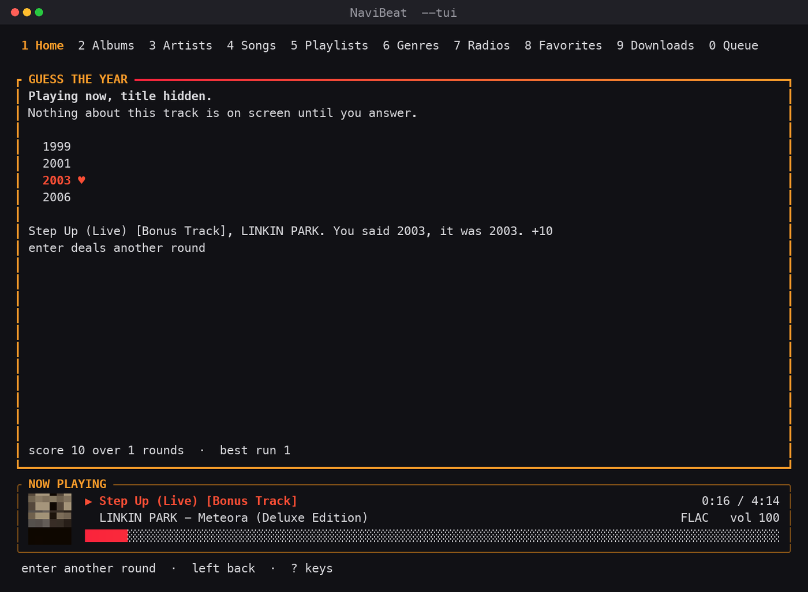
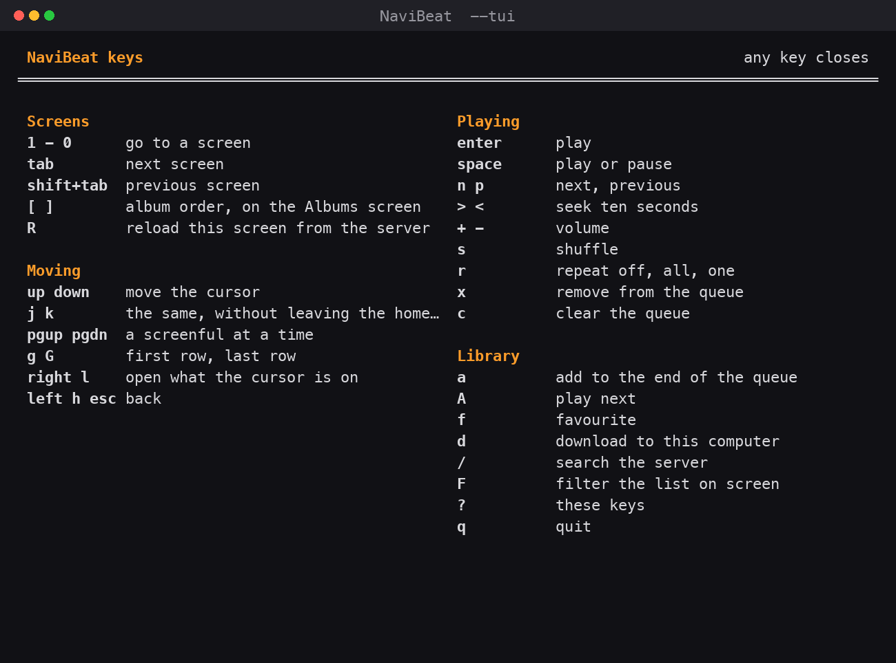

<div align="center">



# NaviBeat for Linux

**A native desktop music player for your own Navidrome or OpenSubsonic server.**

Part of the NaviBeat ecosystem. This build is for **Linux only**. For the Apple ecosystem, see the [App Store links](#part-of-the-navibeat-ecosystem) below.

[Download](#download) &nbsp;&middot;&nbsp; [Features](#features) &nbsp;&middot;&nbsp; [Install](#install) &nbsp;&middot;&nbsp; [Website](https://navibeat.app/linux) &nbsp;&middot;&nbsp; [Report a bug](../../issues/new/choose)

[](https://navibeat.app/linux-stats)
[](../../releases/latest)
[](https://navibeat.app/linux-stats)

[](https://buymeacoffee.com/nenadjokic)
[](https://paypal.me/nenadjokicRS)

</div>

---

## Beta software, please read

> **NaviBeat for Linux is in BETA.** It is built and tested on real hardware, but it is early, and **you may encounter bugs.** If something breaks, misbehaves, or looks wrong, that is genuinely useful to know: please [open an issue](../../issues/new/choose) so it can be fixed. This is exactly the stage where your reports shape the app.

The Apple builds (iPhone, iPad, Mac, Apple TV, Apple Watch) are shipping releases on the App Store. **The Linux build is the newest member of the family and the one still finding its feet**, so treat it as a beta and keep your expectations set to "promising, not polished."

---

## What NaviBeat is

NaviBeat is a **client**, not a server. It connects to a music server you already run and plays your own library from it. It does not host, stream, or provide any music of its own.

It works with:

- **Navidrome** (v0.50 or later)
- Any **OpenSubsonic** compatible server
- **Airsonic-Advanced**, **Gonic**, and classic **Subsonic** servers

The Linux app is a **real native desktop application** written in Kotlin with Compose Multiplatform. No Electron, no web view in a window, no browser tab pretending to be an app. It draws its own window, remembers where you put it, and integrates with your desktop's media keys.

<div align="center">



</div>

---

## Features

Everything the Linux build can do today.

### Your whole library

- **Home** with a Featured Album hero ("pick up where you left off"), Quick Play (Shuffle Mix, Random Album, Favorites, Random Artist), and Most Played
- **Made for You**: Time Machine and Year in Review, built from your own listening history on this machine
- **Smart shelves**: On This Day, Because You Listened, Replay, Discover Mix, plus Your Mixes and Your Last.fm once you connect an account
- **Artists**, **Albums**, **Songs**, **Genres**, **Playlists**, **Favorites**
- **Recently Added**, **Recently Played**, **Recently Released**
- **Internet Radio** stations configured on your server
- **Directories**: browse your library by its folder structure
- Full-text **Search** across artists, albums, songs and playlists

### Playing music

- **Now Playing** with album art, a quality badge (FLAC, MP3 bitrate, and more), star ratings, and full transport controls
- **Time-synced lyrics**, with an optional word-by-word karaoke mode when your server has the timing
- **Mini Player** in a compact window that stays on top of your other work
- **Continue where you left off**: resume a track partway through, or start it over
- **AutoMix** endless playback
- **10-band equalizer** (32 Hz to 16 kHz, plus or minus 12 dB per band), **ReplayGain**, and **crossfade**
- **Stream quality** picker: send the original file untouched, or ask the server to transcode to a lighter tier

### Offline and downloads

- **Download** tracks, albums and playlists for offline listening
- **Prefer Downloaded Music**: play the local copy when you have one, even while online
- **Offline Mode**: show and play only what you have downloaded
- Concurrent-download control and an LRU **cache size limit**

### NaviSyncRock: your library on a Rockbox player

- Send music to a connected **Rockbox iPod or player**, right from the app
- Your **server** does the transcoding; album art is re-encoded so old hardware renders it
- Playlists are written correctly, and plays made on the device sync back
- Set it up from **Settings > NaviSyncRock**, or just plug the player in and it appears in the sidebar
- **This is a paid add-on on the Mac. On Linux it is free.**

### Stats and services

- **Listening Stats** with a Recent Plays timeline
- **Server Health**: see how completely your server returns artist images, lyrics and album art
- Connect **Last.fm** and **ListenBrainz** for artist enrichment and personalized shelves

### Built for a homelab

- Custom **HTTP headers** for Cloudflare Access and Authelia
- **mTLS client certificates** for a server behind mutual TLS
- Works over **Tailscale** and behind your own reverse proxy, with no third-party relay in between
- **Multi-library** support

### Looks and desktop fit

- **Dark**, **light**, or **system** theme
- **Frosted Glass**: a translucent window, tinted for readability, that asks the compositor to blur behind it (KDE and picom oblige; GNOME shows the tint)
- Remembers its **window size and position**
- **Media-key and desktop integration** over MPRIS
- **A terminal client** (`--tui`) for a headless server or a Raspberry Pi over SSH, with cover art,
  a full Now Playing screen, time-synced lyrics and a listening heatmap
- **Zero analytics, zero trackers**

<div align="center">

 

</div>

---

## No desktop? It runs in your terminal

NaviBeat does not need a display at all. Add `--tui` and it opens a **full terminal client**, and on
a machine with no display it starts that way by itself. A Raspberry Pi, a home server, a NAS, a box
you only ever reach over SSH: your library plays there, with the same queue and the same downloads
as the window.

```bash
./NaviBeat-linux-x86_64.AppImage --tui
```

<div align="center">



</div>

**Your library, what is coming, and the words, at once.** Every section sits in its own frame, and
the one your keys are going to is drawn in NaviBeat's own red to orange gradient, so you can see
where you are without reading anything.

- **`Tab` moves between the panes**: the library, Up Next, and the lyrics. In the queue `enter` jumps
  to that track and `x` takes it out; in the lyrics, `enter` **seeks to that line**.
- **Real cover art**, drawn in terminal cells. One cell carries two pixels in full colour, so an
  album page shows the record. There is a small sleeve beside the transport too.
- **Ten screens on the number row.** Home, Albums, Artists, Songs, Playlists, Genres, Radios,
  Favorites, Downloads and the Queue, with album, artist, playlist and genre screens behind them.
- **Search your server** with `/`, filter what is on screen with `F`, turn the side panes on or off
  for any screen with `w`.
- **A log with the time on it.** Two lines above the transport say what you just queued, favourited
  or downloaded, and they stay, so an action taken while you were looking elsewhere leaves a trace.
  **Activity** on Home has the whole session.
- **playerctl and your media keys** see it, exactly as they see the window.
- **Pairing on first run**, so a headless machine never needs a desktop to get started.

Under 90 columns the panes stand down and the list takes the whole width, because a title that fits
whole is worth more than a column that does not.

<div align="center">



</div>

**Now Playing, at the size a record deserves.** A whole screen for what is on: the cover takes as
much of the frame as it can hold, with the title, the artist, the album, the year and the format
beside it, then what is coming next and the words, moving with the song. It is the first thing on
Home, so `1` then `enter` gets you there from anywhere.

`H` and `L` widen and narrow the side column on the list screens, two cells at a time. A library of
short album titles wants a wider queue and a library of box sets wants the opposite, so that is
yours to set.

<div align="center">



</div>

**Listening** is a heatmap of your own play log, seven days by twenty four hours, with your busiest
hour and your top artists, albums and songs underneath. `[` and `]` move between week, month, year
and all time. It is kept on your machine and nowhere else, and it fills as you listen.

<div align="center">



</div>

**Guess the Year** plays a track from your own library with its name hidden and asks you for the
year. Ten points exact, eight within two, and the track keeps playing after you answer. Both of these
sit on Home.

Keys are the ones a terminal listener already has in their fingers, and `?` shows the whole map:

<div align="center">



</div>

Your terminal stays yours. NaviBeat's colour runs across the progress bar where the terminal has
24-bit colour, steps down to the 256 colour cube, then to plain red and yellow on the sixteen colour
consoles, and finally to ASCII on a serial line. Everything else takes your own palette, so NaviBeat
inside your Gruvbox looks like part of your terminal. `--colors=truecolor|256|16|mono` overrides the
detection and `NO_COLOR` is honoured.

---

## Download

Grab the latest **AppImage** for your machine from the [latest release](../../releases/latest):

| Your machine | Download |
| --- | --- |
| **PC or laptop**, Intel or AMD, 64-bit | [`NaviBeat-linux-x86_64.AppImage`](../../releases/latest/download/NaviBeat-linux-x86_64.AppImage) |
| **ARM 64-bit**: Raspberry Pi (64-bit OS), Asahi Linux on Apple Silicon, ARM servers | [`NaviBeat-linux-aarch64.AppImage`](../../releases/latest/download/NaviBeat-linux-aarch64.AppImage) |

The AppImage is a single self-contained file. It carries **its own Java runtime and its own VLC**, so
there is nothing to install.

### Install it with your package manager

**Debian, Ubuntu, Linux Mint, Raspberry Pi OS:**

```bash
sudo install -d /etc/apt/keyrings
curl -fsSL https://dl.navibeat.app/navibeat-repo.gpg | sudo tee /etc/apt/keyrings/navibeat.gpg >/dev/null
echo "deb [signed-by=/etc/apt/keyrings/navibeat.gpg] https://dl.navibeat.app/deb stable main" \
  | sudo tee /etc/apt/sources.list.d/navibeat.list
sudo apt update && sudo apt install navibeat
```

**Fedora, RHEL, Rocky, AlmaLinux:**

```bash
sudo tee /etc/yum.repos.d/navibeat.repo >/dev/null <<'REPO'
[navibeat]
name=NaviBeat
baseurl=https://dl.navibeat.app/rpm
enabled=1
gpgcheck=1
repo_gpgcheck=1
gpgkey=https://dl.navibeat.app/navibeat-repo.asc
REPO
sudo dnf install navibeat
```

That is the whole thing: NaviBeat lands in your application menu, and **`sudo apt upgrade` or
`sudo dnf upgrade` carries it forward with the rest of your system**. Both repositories are signed,
both architectures are in them, and the package brings its own Java runtime and its own VLC, so it
pulls in nothing else. On Fedora that last part matters more than it sounds: VLC lives in RPM
Fusion, and NaviBeat does not ask you to add it.

### Or straight from our own host

Every release also lives at **`dl.navibeat.app`**, on a path that always points at the newest build:

```bash
mkdir -p ~/Applications && cd ~/Applications
curl -L -o NaviBeat.AppImage https://dl.navibeat.app/linux/latest/NaviBeat-linux-x86_64.AppImage
chmod +x NaviBeat.AppImage
./NaviBeat.AppImage
```

Swap `x86_64` for `aarch64` on a Raspberry Pi or Asahi Linux, and add `-slim` if you already have
VLC. Re-running that same command later replaces your copy with the current release, so there is no
version number to look up. `https://dl.navibeat.app/linux/latest.json` says which version is live,
and every build also keeps a permanent path of its own, like
`https://dl.navibeat.app/linux/0.9.68/NaviBeat-linux-x86_64.AppImage`, for pinning to one version.

Already run VLC and want a smaller download? The **slim** builds use the one you have:
[`x86_64-slim`](../../releases/latest/download/NaviBeat-linux-x86_64-slim.AppImage) &middot;
[`aarch64-slim`](../../releases/latest/download/NaviBeat-linux-aarch64-slim.AppImage)

Curious how many people are running it? The counter badge above is live from the GitHub API, and [navibeat.app/linux-stats](https://navibeat.app/linux-stats) breaks it down by day, by week and by architecture. GitHub only reports a running total, so the per-day numbers are snapshots taken four times a day.

---

## Install

1. **Download** the AppImage for your machine from the [latest release](../../releases/latest) (x86_64 for most PCs, aarch64 for a Raspberry Pi or Asahi Linux).
2. **Make it executable:**
   ```bash
   chmod +x NaviBeat-linux-x86_64.AppImage
   ```
3. **Run it:**
   ```bash
   ./NaviBeat-linux-x86_64.AppImage
   ```

### Where to keep it

An AppImage does not really "install", it is a single file you run directly. The natural home for it is a **`~/Applications`** folder in your home directory:

```bash
mkdir -p ~/Applications
mv NaviBeat-linux-x86_64.AppImage ~/Applications/
chmod +x ~/Applications/NaviBeat-linux-x86_64.AppImage
```

To get NaviBeat into your application menu with its icon, use an AppImage manager. Either of these works:

- [**AppImageLauncher**](https://github.com/TheAssassin/AppImageLauncher), available in most distributions. It watches `~/Applications`, adds a menu entry, and handles updates.
- [**AppManager**](https://github.com/kem-a/AppManager), a GTK app that installs and manages AppImages in a macOS-style way.

Without either, you can run the AppImage directly, or add a `.desktop` file to `~/.local/share/applications` by hand.

### Requirements

- **Linux x86_64 or ARM64 (aarch64)**, 64-bit, with **glibc 2.36 or newer**: Debian 12, Ubuntu 22.04, Fedora 37, Raspberry Pi OS Bookworm and anything more recent.
- **Nothing to install.** Java and VLC both travel inside the download. If you picked a `-slim` build, that one uses the VLC you already have (`sudo dnf install vlc`, `sudo apt install vlc`, `sudo pacman -S vlc`).
- **A terminal, or a desktop.** With no display, `--tui` gives you the whole app in a terminal.
- **FUSE** to launch the AppImage by double-clicking. Most desktops have it; if not:
  - Debian / Ubuntu: `sudo apt install libfuse2`
  - or run without FUSE: `./NaviBeat-linux-x86_64.AppImage --appimage-extract-and-run`
- A **Navidrome or OpenSubsonic server** to connect to. NaviBeat is a client and does not come with any music.

On first launch you pair the app with your server: enter its address, username and password.

---

## Keep it updated

An AppImage does not update itself, and chasing a new download every few weeks is the one genuinely
tedious thing about the format. **From 0.9.68 every NaviBeat AppImage carries update information**,
so a manager can update it in place: it keeps your file where it is, keeps your menu entry, and
downloads only the parts that actually changed rather than another 200 MB.

### With Gear Lever, the easy way

[**Gear Lever**](https://flathub.org/apps/it.mijorus.gearlever) is a small app that manages
AppImages. Add NaviBeat to it once, and after that it offers the update itself when one exists.

1. Install Gear Lever from your distribution or Flathub.
2. Open it and drag the NaviBeat AppImage in, or use **Open** and pick the file.
3. It appears in your application menu with its icon. When a new version is out, Gear Lever shows an
   **Update** button.

### From a terminal

[**AppImageUpdate**](https://github.com/AppImage/AppImageUpdate) does the same thing with one
command, and is the tool the update information is written for:

```bash
AppImageUpdate ~/Applications/NaviBeat-linux-x86_64.AppImage
```

It reads the update information inside your copy, compares it against the current release, and
downloads only the changed blocks. If you are already on the newest build it says so and stops.

[**AppImageLauncher**](https://github.com/TheAssassin/AppImageLauncher) also uses it, so if you
already keep your AppImages with that, updates work through the same mechanism.

### What it is doing under the hood

The AppImage carries a line that says where to look, and a small `.zsync` file ships beside every
release. That file is a map of the release, block by block. An update tool fetches the map, compares
it against the copy on your disk, and asks the server only for the blocks that differ. On a typical
release that is a fraction of the whole file, because the bundled Java runtime and VLC do not change
between most versions.

Nothing phones home on its own: NaviBeat itself never checks for updates and never talks to us. The
check happens only when you or your AppImage manager asks for it.

### Installed from apt or dnf?

Then there is nothing to do at all. `sudo apt upgrade` and `sudo dnf upgrade` pick NaviBeat up with
everything else on your machine.

### Or just download it again

Every release stays on this page. Downloading the new AppImage over the old one is always a valid
update, and your settings, pairing and downloads live in your home directory, not in the file.

---

## Part of the NaviBeat ecosystem

This repository is **for the Linux build only**. NaviBeat is a whole family of native apps, and the Apple builds live on the App Store as a single **Universal Purchase** (buy once, use on every Apple device):

| Platform | Where to get it |
| --- | --- |
| **Mac** | [App Store](https://apps.apple.com/app/navibeat/id6763518834?platform=mac) &middot; [navibeat.app/macos](https://navibeat.app/macos.html) |
| **iPhone** | [App Store](https://apps.apple.com/app/navibeat/id6763518834?platform=iphone) &middot; [navibeat.app/iphone](https://navibeat.app/iphone.html) |
| **iPad** | [App Store](https://apps.apple.com/app/navibeat/id6763518834?platform=ipad) &middot; [navibeat.app/ipad](https://navibeat.app/ipad.html) |
| **Apple TV** | [App Store](https://apps.apple.com/app/navibeat/id6763518834?platform=appletv) &middot; [navibeat.app/appletv](https://navibeat.app/appletv.html) |
| **Apple Watch** | [App Store](https://apps.apple.com/app/navibeat/id6763518834) &middot; [navibeat.app/applewatch](https://navibeat.app/applewatch.html) |
| **Linux** | You are here. [navibeat.app/linux](https://navibeat.app/linux) |

The Linux build is **free**. The Apple builds are a one-time $5.99 Universal Purchase.

Website: **[navibeat.app](https://navibeat.app/)**

---

## Feedback and bug reports

The Linux build is beta, and your reports are how it gets better.

- **Found a bug?** [Open a bug report](../../issues/new/choose).
- **Have an idea, or a question?** Start a [Discussion](../../discussions) or open a [feature request](../../issues/new/choose).

When you report a bug, the more you can tell me about your distribution, desktop environment and server, the faster it gets fixed. The issue templates ask for exactly what helps.

---

## Support the developer

NaviBeat for Linux is free, with no ads, no tracking and no subscription. If it earns a place in your setup, a coffee genuinely helps and means a lot.

<div align="center">

[](https://buymeacoffee.com/nenadjokic)
&nbsp;
[](https://paypal.me/nenadjokicRS)

</div>

---

## Privacy

NaviBeat talks to your server and to nobody else. There are no analytics and no trackers in the app. Full policy at [navibeat.app/privacy](https://navibeat.app/privacy.html).

## License

NaviBeat for Linux is **free to use, but it is not open source.** It is proprietary software, and this repository holds only the release binaries and documentation, never the source. You may download and use it at no cost; you may not copy, redistribute, modify, reverse engineer, or reuse it. See [LICENSE](LICENSE) for the full terms.

## Updates

Every update ships here as a new release with the binary attached and a **What's New** note. Watch this repository, or check [Releases](../../releases), to stay current.

---

## How I build NaviBeat

NaviBeat is my hobby project, and I genuinely love it. I build the app I want to use myself first, and then I share it with the world.

Keeping this many native builds moving on my own is hard: macOS, Apple TV, iPhone with its Watch app, and now Linux. So I lean on agentic coding heavily. I actively use Claude Code to help me navigate the code, chase bugs, and work through change requests. That is what lets one person keep all of these apps in sync.

By day I am a Business Analyst, working mostly on direct-to-consumer products at a large FMCG company. I know a few programming languages reasonably well, but my real strength is the logic and the requirements: how a thing should behave, and how to express that across different syntaxes. So I do not just vibe-code. Every change becomes a proper, DevOps-style backlog task: I groom it, then push it through development, UAT, public beta, and finally production. There is real Q&A on my side.

Still, people are only people, and I can miss things. That is why I rely so much on beta testers filing bugs and change requests, and it is why your reports genuinely matter. If anything in the app ever feels like too much AI, or just feels off, please reach out. I am always happy to fix it and run another round of CRs to make NaviBeat better.

The code itself stays private and proprietary. The agents only make the building faster.

<div align="center">

Made with care in Belgrade by Nenad Jokic. &nbsp;&middot;&nbsp; NaviBeat is not affiliated with the Navidrome or Subsonic projects.

</div>
